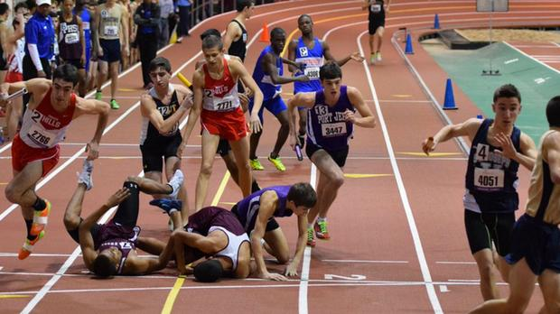

# Relay-Data-Race with DSX, In Madrid - About Madrid!

Assign roles to each team member - and follow the instuctions.

- Person sitting most to the North is the Project Manager.
- From her/him, point remaining member clockwise, in same order as listed here.

## 1 - Project Manager

Create a project in DSX

Add each team member as a collaborator, giving her/him full admin rights.

## 2 - Data Uploader

- Tell the Project Manager your email, she/he needs this to add you to the page.
- Download the Data from this Repository (Data folder), `madrid_houses_with_centre.csv`
- If you are added, add the data to the project. Go to "Assets" and upload the data.

## 3 - Notebook Uploader

- Tell the Project Manager your email, she/he needs this to add you to the page.
- Download the .ipynb from this Repository (Notebook folder), `Hackathon - House Prediction.ipynb`
- If you are added, add the notebook to the project. Go to "Assets" > "New Notebook"
- use "Default Anaconda Free (1 vCPU and 4 GB RAM)"

## 4, 5, 6... - All other members

- Tell the Project Manager your email, she/he needs this to add you to the page.
- Give coffee or tea to team members and class instructor
- Take a look at the data, think of what model you would apply to predict price

## Everybody - Start creating a daffy Model!

Read the notebook instructions and try create the best performing model!
The method of calculating the performance is outlined in the notebook.

## General Hints & Tips

- You can duplicate notebooks - members can try out strategies in parallel
- Some models can be deployed in WML, and a webapplication can be easily created with them.
Alonso from Madrid, has created this demo:
http://ialonso.es/projects/dsxwml/
- DSX Can connect to other data sources as well
- DSX has a Local Version
